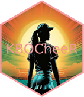
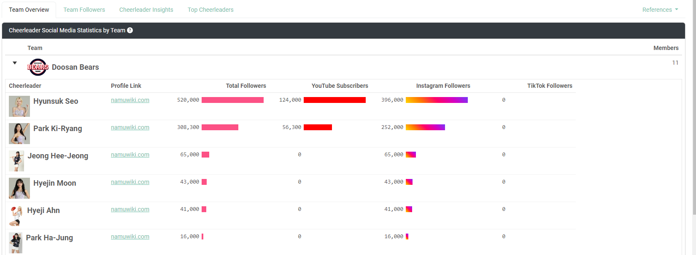
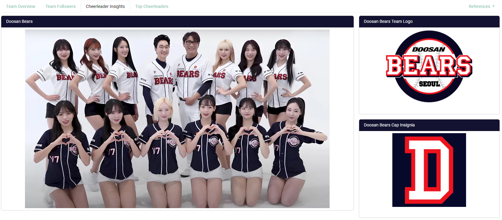
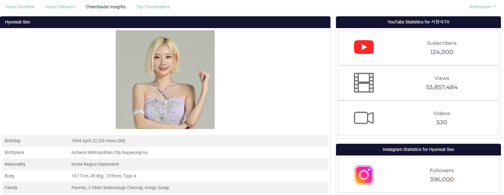
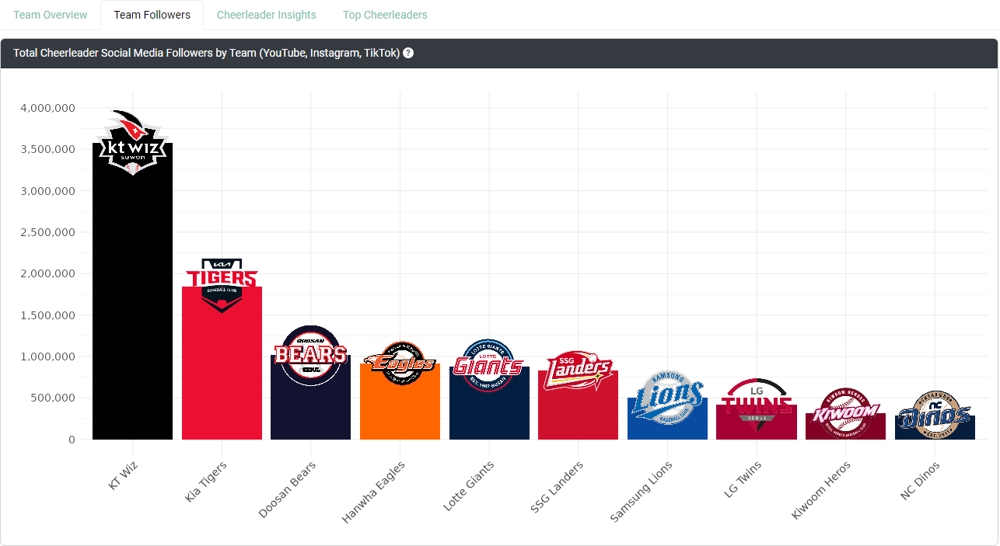
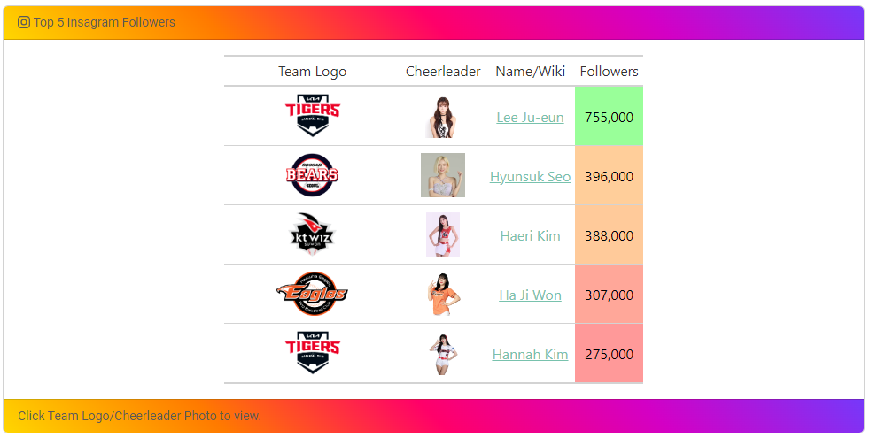

```{r, include = FALSE}
knitr::opts_chunk$set(
  collapse = TRUE,
  comment = "#>",
  fig.path = "man/figures/README-",
  out.width = "100%"
)
```

# KBO Cheerleaders 

<p style="font-size: 16px; text-align:justify;">Dive into the dynamic world of Korean Baseball cheerleaders with this open-source interactive app. Explore detailed profiles, vibrant photos, and fascinating insights about your favorite KBO League cheerleaders. This comprehensive platform brings together all the information you need to discover and appreciate the stars of Korean Baseball cheerleading, offering a rich and immerse experience in one convenient place!</p>

## Installation

You can install the development version of KBOCheerleaders from [GitHub](https://github.com/) with:

``` r
# install.packages("devtools")
devtools::install_github("JBC-Inc/KBOCheerleaders")
```

## Abstract

<div style="padding: 20px; border-radius: 8px; background-color: #f9f9f9; box-shadow: 0 0 10px rgba(0, 0, 0, 0.1);"><p style="font-size: 16px; text-align:justify;">The "Pikki Pikki" song, originally by <a href="https://youtu.be/M5HXKSR1hKc?t=42" target="_blank">Olive Beat\'s Lecon Studios</a>, has become a viral sensation in the KBO (Korean Baseball Organization) League, particularly associated with the Kia Tigers, where cheerleaders use it to celebrate and taunt rival teams with a signature low-energy dance. This trend has sparked the "Pikki Pikki Challenge" and gained widespread attention across social media.</p>

<p style="font-size: 16px; text-align:justify;">This Shiny app, however, goes beyond just the Kia Tigers. It covers all KBO cheerleading teams, focusing on analyzing their social media presence across YouTube, Instagram, and TikTok. By aggregating and visualizing likes, followers, and subscribers, the app identifies the most influential cheerleaders, offering fans an engaging platform to explore the vibrant culture of KBO cheerleading.</p></div>

## Full Description

<div style="padding: 20px; border-radius: 8px; background-color: #f9f9f9; box-shadow: 0 0 10px rgba(0, 0, 0, 0.1);"><p style="font-size: 16px; text-align:justify;">This project introduces an open-source interactive web application designed to explore the world of Korean Baseball Organization (KBO) cheerleaders. The app consolidates profiles, photos, and biographical details from Namu Wiki and team pages, providing users with a seamless experience for discovering and interacting with their favorite cheerleaders. Key features include interactive tables built with reactable and gt, as well as dynamic visualizations that display follower statistics across teams and individual leaderboards. Users can easily compare follower counts per cheerleader by team, making this app a comprehensive and engaging tool for diving into the vibrant culture of KBO cheerleading.</p>


<p style="font-size: 16px; text-align:justify;">This project features an interactive web application focused on exploring and showcasing Korean Baseball Organization (KBO) cheerleaders. The app leverages modern web technologies to create an intuitive and dynamic user experience that combines data analysis with rich multimedia content.</p></div>

### Key Features and Technology Stack:

- **Expandable Reactable Tables:** On the “Team Overview” tab, users can view a reactable table where each row represents a team. Expanding a row reveals detailed profiles of individual cheerleaders, complete with follower counts by platform. Each cheerleader’s row also includes bar charts for total followers and platform-specific statistics. Clicking on a cheerleader’s photo within the table returns users to the insights page, displaying her individual stats.
 
 

 - **Dynamic Team and Cheerleader Selection:** A dropdown menu allowing users to select any KBO team. Once a team is selected, the app automatically updates the cheerleader roster and switches to the “Insights” tab, where the team’s photo, logo, and hat are prominently displayed.
 
 

 - **Interactive Insights Page:** When a cheerleader is selected, the insights view transitions from team-level to individual cheerleader-level, highlighting her photo, biographical details, and social media statistics in bslib-powered cards. The app fetches data from Namu Wiki and official team pages, ensuring accurate content.
 
 

 - **Seamless Navigation Across Tabs:** The “Stats” tab allows users to explore aggregate metrics for each team. Clicking on a column, such as aggregate followers, will redirect users back to the “Insights” tab, focusing once again on the selected team’s details.
 
 

 - **Top Cheerleaders Leaderboards:** The “Top Cheerleaders” tab highlights the leading five cheerleaders across platforms like YouTube, Instagram, and TikTok. Each leaderboard features detailed cards that include the cheerleader’s team logo, picture, a link to her Namu Wiki page, total subscribers, total views, and a views-per-subscriber ratio. {gt} tables with interactive JavaScript elements allow for a rich exploration of the leaderboard data.
 


 - **Comprehensive Social Media Analytics:** The app integrates data visualizations to provide a comparative analysis of cheerleader popularity. Followers, likes, and subscribers are analyzed across different platforms, giving users a multi-dimensional view of the cheerleaders’ digital influence.

 - **Robust Data Integration and Analysis:** The app’s data processing pipeline utilizes {rvest} for web scraping and {httr2} for API requests, ensuring that all cheerleader and team data is current. The app also employs advanced techniques for matching image URLs to social media profiles, creating an enriched user experience.

 - **User-Friendly Design and Experience:** Built with {bslib}, the app’s UI features responsive layouts, ensuring optimal display across devices. Cards and layout elements are dynamically adjusted based on user interactions, delivering a visually appealing experience.

<p style="text-align: justify;">This R Shiny app is not just a data-driven tool but a gateway into the lively culture of KBO cheerleading. It consolidates photos, profiles, and statistics from hundreds of web pages into one cohesive platform. By aggregating data from multiple sources, including Namu Wiki and team sites, the app offers a seamless experience for fans and curious users alike. Whether users are dedicated followers of a specific team or are interested in exploring the cheerleading landscape across the KBO League, this app provides an engaging and comprehensive journey. Users can discover their favorite cheerleaders, track their social media influence, and dive deep into the vibrant cheerleading culture that defines the KBO experience.</p>


