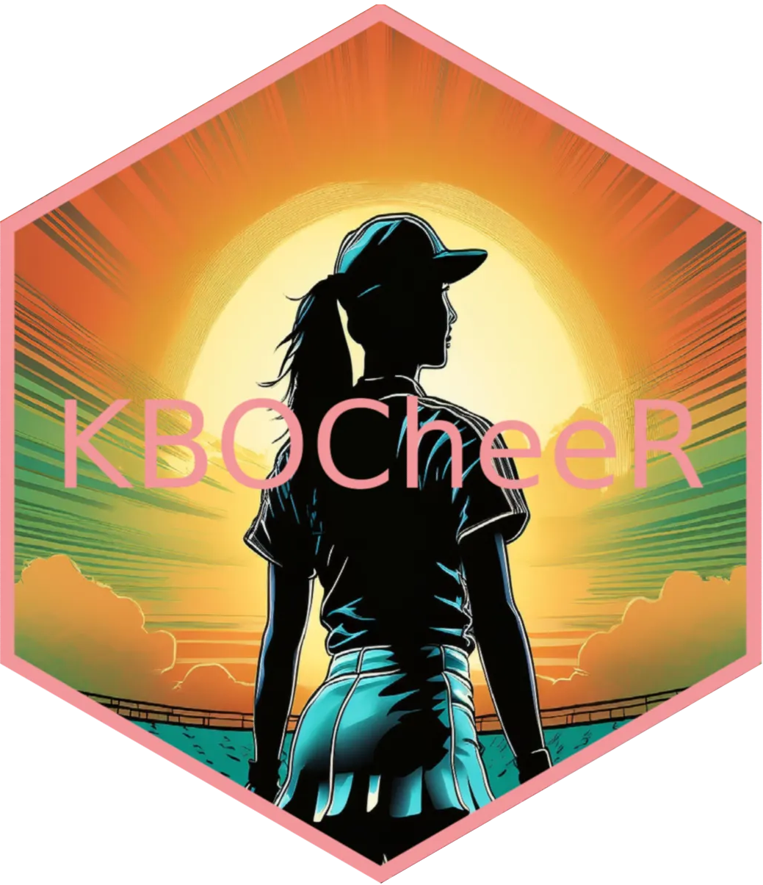

<div style="display: flex; align-items: center;">


<h1 style="margin: 0; padding: 0;">
KBO Cheerleaders
</h1>

</div>

An open source exploration into the world of Korean Baseball
Cheerleaders. Explore the vibrant world of Korean Baseball cheerleaders
with this interactive app. Discover profiles, photos, and details about
your favorite KBO League cheerleaders all in one place!

## Installation

You can install the development version of KBOCheerleaders from
[GitHub](https://github.com/) with:

``` r
# install.packages("devtools")
devtools::install_github("JBC-Inc/KBOCheerleaders")
```

## Abstract

This project introduces an open-source interactive web application
designed to explore the world of Korean Baseball Organization (KBO)
cheerleaders. The app consolidates profiles, photos, and biographical
details from Namu Wiki and team pages, providing users with a seamless
experience for discovering and interacting with their favorite
cheerleaders. Key features include interactive tables built with
reactable and gt, as well as dynamic visualizations that display
follower statistics across teams and individual leaderboards. Users can
easily compare follower counts per cheerleader by team, making this app
a comprehensive and engaging tool for diving into the vibrant culture of
KBO cheerleading.
