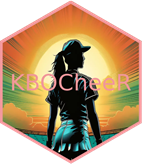

<div style="display: flex; align-items: center;">


<h1 style="margin: 0; padding: 0;">
KBO Cheerleaders
</h1>

</div>

An open source exploration into the world of Korean Baseball
Cheerleaders. Explore the vibrant world of Korean Baseball cheerleaders
with this interactive app. Discover profiles, photos, and details about
your favorite KBO League cheerleaders all in one place!

## Installation

You can install the development version of KBOCheerleaders from
[GitHub](https://github.com/) with:

``` r
# install.packages("devtools")
devtools::install_github("JBC-Inc/KBOCheerleaders")
```

## Abstract

<div style="padding: 20px; border-radius: 8px; background-color: #f9f9f9; box-shadow: 0 0 10px rgba(0, 0, 0, 0.1);">

<p style="font-size: 16px;">
The Pikki Pikki song, originally by
<a href="https://youtu.be/M5HXKSR1hKc?t=42" target="_blank">Olive Beat's
Lecon Studios</a>, has become a viral sensation thanks to its
association with KBO Baseball League cheerleaders. The song is famously
linked to the Kia Tigers, where cheerleaders use it to celebrate and
subtly taunt opposing teams with a unique, low-energy dance.
</p>
<p style="font-size: 16px;">
This cheer has sparked the Pikki Pikki Challenge and gained widespread
attention on social media platforms. However, this Shiny app is not just
about the Kia Tigers. It covers all KBO Baseball League cheerleading
teams, focusing on their social media presence. The app aims to identify
which cheerleaders have the most likes, followers, and subscribers
across YouTube, Instagram, and TikTok.
</p>
<p style="font-size: 16px;">
By analyzing social media metrics, the app highlights the most popular
cheerleaders, showcasing their influence and reach. This comprehensive
approach allows fans to explore and appreciate the vibrant cheerleading
culture across the entire KBO League. Enjoy!
</p>

</div>

## Full Description

This project introduces an open-source interactive web application
designed to explore the world of Korean Baseball Organization (KBO)
cheerleaders. The app consolidates profiles, photos, and biographical
details from Namu Wiki and team pages, providing users with a seamless
experience for discovering and interacting with their favorite
cheerleaders. Key features include interactive tables built with
reactable and gt, as well as dynamic visualizations that display
follower statistics across teams and individual leaderboards. Users can
easily compare follower counts per cheerleader by team, making this app
a comprehensive and engaging tool for diving into the vibrant culture of
KBO cheerleading.
